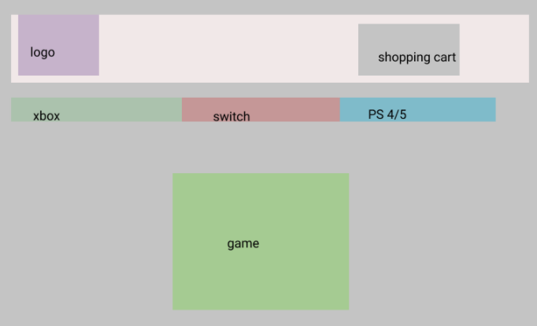

<h1>Game Lords</h1>
<h1>Game Lords</h1>
    <ul>
        <li>User Stories</li>
        <li>Wireframes</li>
        <li>Sprints</li>
    </ul>

<h1>User Stories</h1>

Any Game Lord user with an admin account can rent or list games to rent out to other admins.

<h3>Non-admins can:</h3>
<ul>
    <li>View available games to rent</li>
    <li>Rent Games</li>
</ul>

<h3>Admins can:</h3>
<ul>
    <li>View available games to rent</li>
    <li>Rent Games</li>
    <li>Create game listings to rent</li>
    <li>Edit game listings to rent</li>
    <li>Delete Games to rent</li>
</ul>

<h1>Wireframes</h1>

<h2>Homepage</h2>

The home page will have a drop down menu, a slideshow and a list of console with supporting games that are available to rent

<h2>Library</h2>

The library page will allow you to filter out only the compatible games for the selected console.

<h2>Game Profile Card</h2>

When you click on a game, a pop up profile card of that video game will show a picture of the game along with a description and a add to cart button.

<h1>Database Models</h1>
<!-- <h3>User</h3>
<ul>
    <li></li>
</ul> -->
<h3>Games</h3>
<ul>
    <li>Game</li>
    <li>Price</li>
    <li>Console</li>
</ul>

<h3>Shopping Cart</h3>
<ul>
    <li>Game</li>
    <li>gmaes.id</li>
</ul>

<h3>Consoles</h3>
<ul>
    <li>Name</li>
    <li>games.id</li>
</ul>

<h2>Sprints</h2>
<h3>Sprint 1</h3>
<ul>
    <li>Focus on the views of our main page</li>
    <li>CSS for slideshow</li>
    <li>CSS for drop down menu</li>
    <li>JS for drop down menu</li>
    <li>JS for slideshow</li>
    <li>Add routes and test server</li>
    <li>Add models</li>
    <li>Work on CRUD</li>
    <li>Add website name to main page</li>
    <li>Work on README.md</li>
</ul>